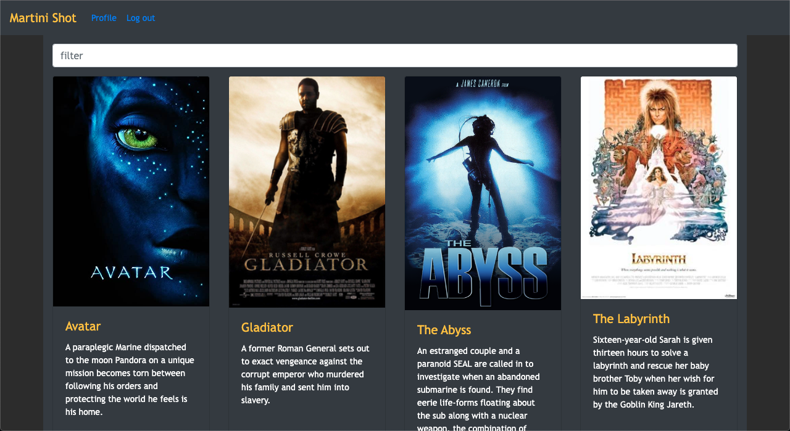
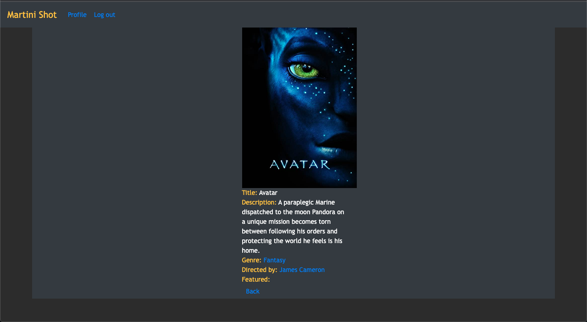
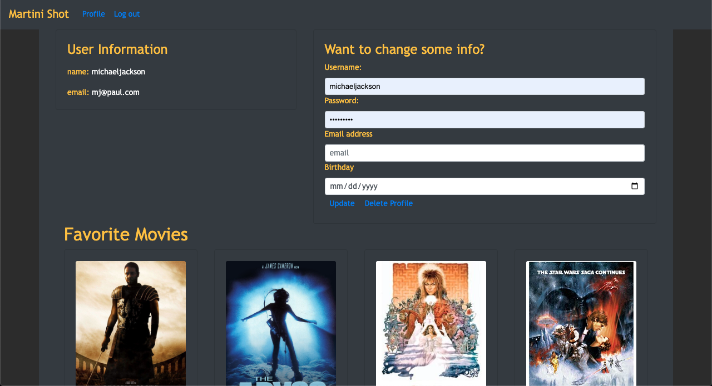

Martini Shot 
<a href="https://martini-shot-react.netlify.app/">Click here to see it online</a>

Martini Shot is an app designed as a repository for a few of my favorite movies. Utilizing the MERN stack, users are able to create a profile, browse a selection of movies, find infomation about those movies such as the movie's description, genre and director. Once the profile is created, the user can create a list of their own favorite movies and update their user information.

The building process of the app included building the entire back-end with authentication and authorization that included JWTtoken, CORS and Passport.

to run: "parcel src/index.html" in terminal.

To make this app I used the following: 
Node.js 
React 
Bootstrap 
Redux 
Parcel 
MongoDB 
Axios 
Railway 
Javascript 
HTML 
CSS 
Netlify 
 
 

 

 

